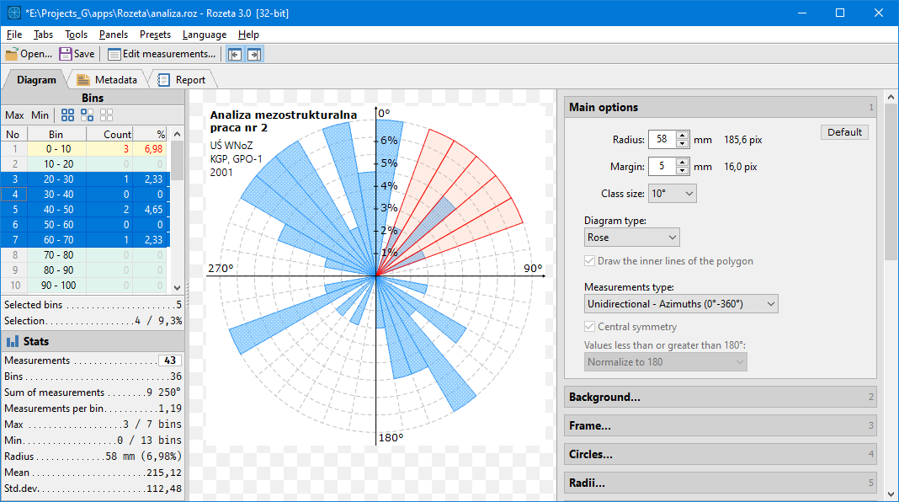
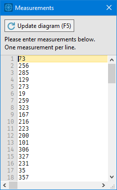
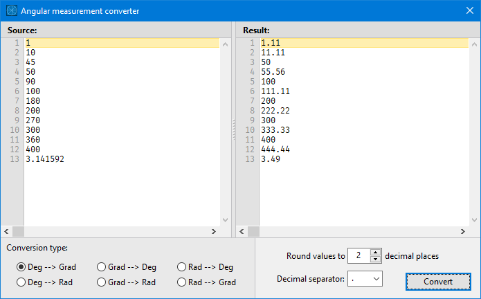
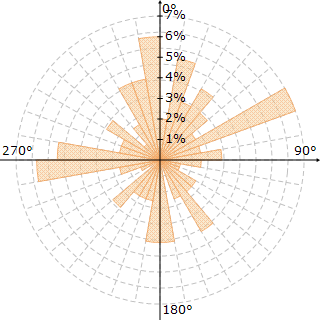
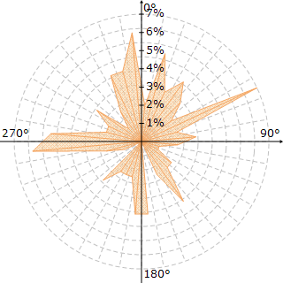
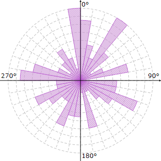
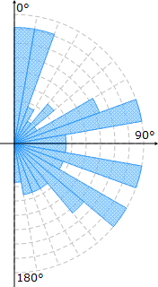
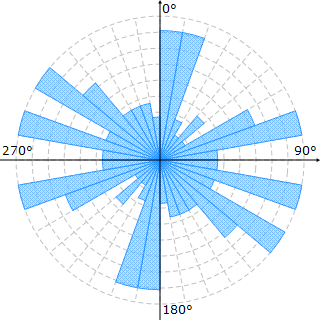

# Rozeta - Program description

[Polish version / Polska wersja](Rozeta_description_PL.md)

## About

**Rozeta** is a program that plots **rose diagrams**.

A rose diagram is a circular histogram that shows the distribution of linear elements on a plane. It can be, for example, the distribution of transport directions in a sedimentation basin, inclinations of fracture planes, paleocurrent directions, wind directions, etc.

Rose diagrams are often used in structural geology, geography and other sciences.

## Technical information

Rozeta works fine on Windows 7 or later.

The program is available as a ZIP archive. Before starting, extract all files to the previously created directory. As the program saves the configuration data files in the current directory (with the EXE file), it cannot be a system protected directory.

The program is **portable** and does not save data in any other place (e.g. in the system registry), so you can copy it to a portable drive (e.g. flash drive) and use it on another computer.

If you want, you can associate `.roz` files (JSON-formatted text files) and `.rozx` (ZIP-compressed ROZ files) with Rozeta. Just remember that the association is saved in the system registry, so if you delete the program from disk, you will have to remove the association in the registry yourself.

The `.rozt` files are template files. They store only the visual parameters of the diagram, without measurements.  
To save the current diagram settings to a template, select menu `Presets` -> `Save diagram settings to a template file...` (shortcut `Ctrl+Shift+T`).  
To load a template, select menu `Presets` -> `Load diagram settings from a template...` (shortcut `Ctrl+Shift+L`).

## License and download

The program is completely free (**public domain**) and you can use it without any restrictions, also for commercial purposes.

Program home page (with compiled binaries): [https://www.pazera-software.com/products/rozeta/](https://www.pazera-software.com/products/rozeta/)  
Source code: [https://github.com/jackdp/Rozeta](https://github.com/jackdp/Rozeta)  
Support for the author: [https://www.pazera-software.com/donation/](https://www.pazera-software.com/donation/)

## Measurements

The input shall be a series of angular measurements in degrees. The **Measurements** window is used to enter data. To display this window, select the menu `File`->`Edit Measurements...` or press the `F4` key.

The measurement values should be integers or real (float) numbers. The decimal separator can be `.` (period) or `,` (comma). One measurement should be given in one line. Blank lines and lines with invalid values ​​are ignored.

If you have measurements in grads or radians, you can convert them into degrees using the built-in **Angular measurement converter** (`F6` key).

## Drawing a diagram

At the beginning, the program creates numerical ranges (*bins*) of the size specified in the **Class size** drop-down list (by default 36 10-degree ranges).

Each of the previously entered measurements is assigned to an appropriate angular range. All ranges (except the first one) are left-open and right-closed (with the default settings, the value of 10° will be qualified to the 1st range, the value of 11° - to the second). 0° belongs to the first range, 360° to the last.

The radius of the diagram represents the number of measurements in the range(s) with the greatest number of measurements.

Depending on the selected diagram type, the drawing method is as follows:

1. **"Classic" rose** (pies, wedges)  
For each angular range with the number of measurements greater than 0, a circle segment (pie) is drawn with a length proportional to the previously determined radius and the number of measurements in this range.

2. **Polygon**  
For each angular range with the number of measurements greater than 0, a point in the middle of a given range is marked (e.g. 15° for the range 10°-20°) at a distance proportional to the previously determined radius and the number of measurements in a given range. If the range does not contain any measurements, the zero point is marked. After all points are determined, they are connected with straight lines to form a polygon.

|                    Rose                     |                    Polygon                     |
| ------------------------------------------- | ---------------------------------------------- |
| **1**  | **2**  |

## Types of diagrams depending on the type of measurements

The program allows you to draw diagrams for two types of measurements: unidirectional (azimuths) and bidirectional.

### Unidirectional (azimuth) diagrams

Measurements should be values from 0 to 360 degrees, and in the **Measurement type** list, select `Unidirectional - Azimuths (0°-360°)`. Measurement values outside the range of 0..360 will be ignored.

|               Azimuth diagram               |
| ------------------------------------------- |
|  |

### Bidirectional diagrams

Diagram in half circle or full circle if central symmetry is used.
Measurements should be values from 0 to 180 degrees, and in the **Measurement type** list, select `Bidirectional (0°-180°)`.

|          Bidirectional data - half circle           | Bidirectional data - full circle (central symmetry) |
| --------------------------------------------------- | --------------------------------------------------- |
| **A**  | **B**  |

If in the measuring series there are values outside the numerical range 0..180, the program can ignore such values or "normalize" to 180, that is, so many times add or subtract the value 180 from the given measurement to obtain the value in the range 0..180 (e.g. measurement 230 will then be interpreted as 230 - 180 = **50**).

By default, a half circle diagram is drawn (**A**). For better readability of the diagram, however, you can enable central symmetry (**B**), then each section (pie) of the diagram will also be drawn in the opposite quadrant. The central symmetry is only used when drawing the diagram, the measurement values and statistics will not be modified.

## Shortcuts

|    Shortcut    |                     Action                     |
| -------------- | ---------------------------------------------- |
| Ctrl+1         | Expand panel - Main options                    |
| Ctrl+2         | Expand panel - Background                      |
| Ctrl+3         | Expand panel - Frame                           |
| Ctrl+4         | Expand panel - Circles                         |
| Ctrl+5         | Expand panel - Radii                           |
| Ctrl+6         | Expand panel - Axes                            |
| Ctrl+7         | Expand panel - Pies                            |
| Ctrl+8         | Expand panel - Selected bins                   |
| Ctrl+9         | Expand panel - Title & description             |
| Ctrl+Shift+E   | Expand all panels                              |
| Ctrl+Shift+C   | Collapse all panels                            |
| Ctrl+O         | File - Open...                                 |
| Ctrl+S         | File - Save                                    |
| Ctrl+Shift+S   | File - Save as...                              |
| Ctrl+Shift+R   | File - Save report...                          |
| Ctrl+Shift+P   | File - Save diagram as a PNG file...           |
| F4             | File - Edit measurement list...                |
| Ctrl+Shift+X   | File - Close file                              |
| F5             | Repaint diagram                                |
| F6             | Tools - Angular measurement converter          |
| F7             | Tools - Random diagram                         |
| F12            | Show / hide left panel (with bin list)         |
| Ctrl+F12       | Show / hide right panel (with diagram options) |
| Ctrl+D         | Switch to tab - Diagram                        |
| Ctrl+M         | Switch to tab - Metadata                       |
| Ctrl+R         | Switch to tab - Report                         |
| Ctrl+Shift+L   | Load settings from a template file...          |
| Ctrl+Shift+T   | Save settings to the template file...          |
| Ctrl+Shift+F1  | About program...                               |
| Ctrl+Shift+F12 | Reload current language file (for translators) |
| Ctrl+Shift+I   | A few tech infos (Debug info)                  |

## History

I wrote the first version of the program in 2001, when I was studying geology.  
When I was once again given the task of drawing a rose diagram, I decided to write a program for drawing such diagrams based on the measurements stored in a text file. To write the program I used the Borland Delphi 5 development environment. I never made the program available (I didn't even have a permanent internet connection at the time). The program was used only by a small group of my friends who used it, among others, when writing their master's theses.

I released the second version in 2003 (Polish version) and 2004 (English).  
The program already had a bit more options and was available on my website. Unfortunately, it contained a few bugs that made it almost impossible to use in newer versions of Windows, so after a few years I removed it from my site.

While browsing the source codes of my old programs, I came across the Rozeta and decided to write another version, the 3rd.  
Initially, I wanted to expand version 2.0, but I wanted the program to be open source and use only free development tools, so I wrote Rozeta completely from scratch in the [Lazarus](https://www.lazarus-ide.org/) environment.

Why did I name the program **Rozeta**?
*Rozeta* is a common name for a rose diagram used by geology students in Poland (at least 21 years ago).
